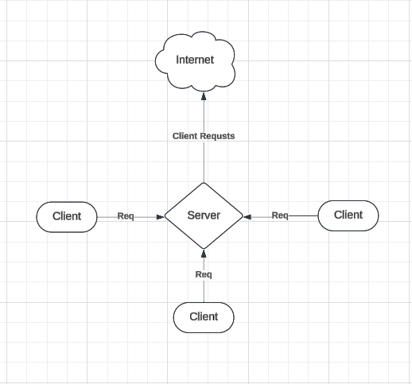

# Abstract

The plan here is to play with the idea of VPNs / proxies / distributed networks / key pair cryptography.
The server will listen on raw tcp with a custom protocol. Clients will connect, exchange keys, and then send encrypted requests to the server. The server will the execute these requests as https requests to external networks (the internet). This way the server is essentially a vpn/proxy. This should work on LAN and WAN.

# Steps

1. Create a central VPN/Proxy server that clients will connect to.
   a. Need to create some basic protocol that the client and server can agree on. Messages will be of type.Request. Need some delimiter or terminating sequence of bytes to denote the end of a message.
2. Create a client that can connect and send requests. These requests will tunnel through the VPN/Proxy.
3. Add some jank ass diffie-hellman key exchange.
   - When the server inits, it will create a key pair.
   - When a client inits, it will create a key pair. It will share the public key with the main server so traffic and be encrypted.
   - The central server will handle the connection of multiple clients and route requests as needed.

